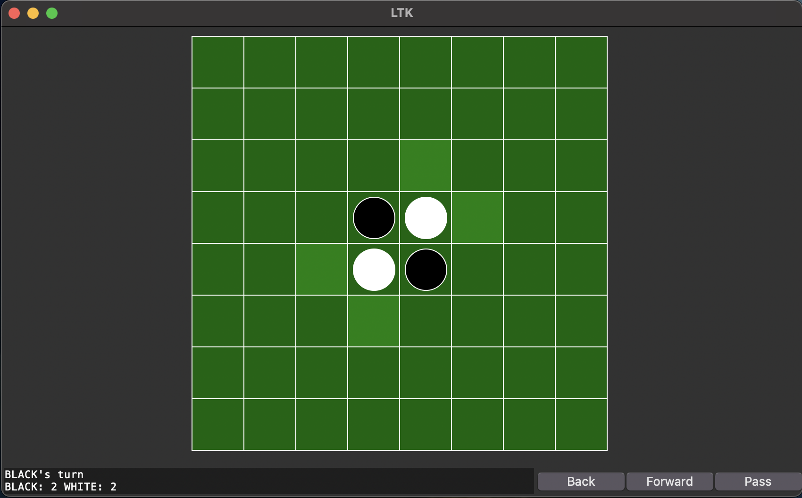

# Reversi

This repository contains the Common Lisp implementation of Reversi.
Run the game by installing SBCL(Steel Bank Common Lisp) to your system and loading the `reversi.lisp` file : `sbcl --load reversi.lisp`.

